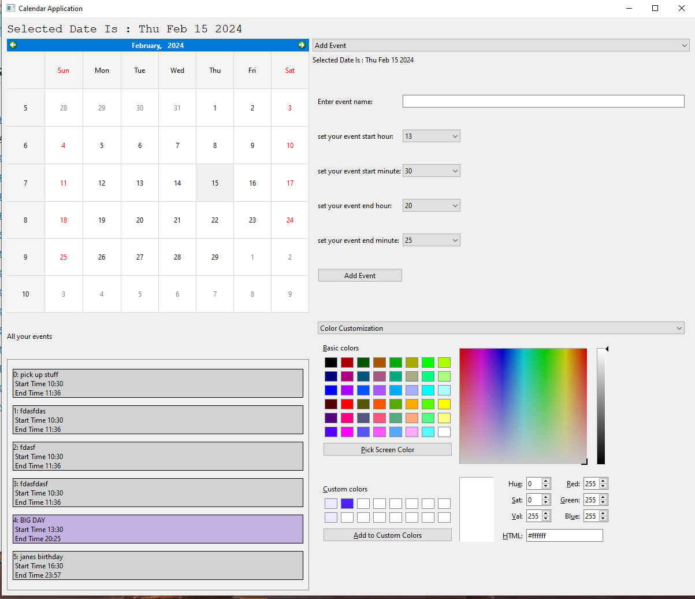

Calendar GUI App using PyQt6

python 3.11.3

PREFACE: This repository only contains an EXE and does not contain a MacOS executable. You must compile it to .app using the file app.py.
This is because pyinstaller does not allow cross OS compilation.

Instructions: To run the EXE double click the app.exe file under the file path dist/app.exe
